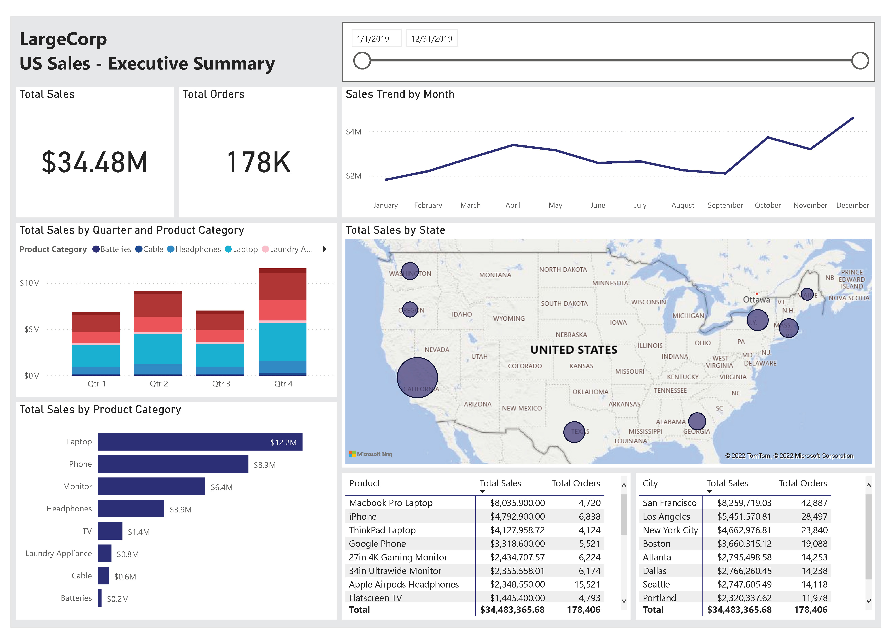

# [Sales Data Analysis and Visualization](project-1.md)

* Used Excel, Power Query, and Power BI to analyze over 185,000 sales records over the course of a year

* Combined and cleaned dataset by using power Query techniques

* Provided category sales statistics through Excel Pivot Tables and data models to prevent miscalculations

* Created an executive summary sales dashboard in Power BI with the ability to segment sales by category, product, region, and time

  

