<iframe title="Chuong_SalesDashboard_Portfolio - Page 1" width="1024" height="720" src="https://app.powerbi.com/view?r=eyJrIjoiNTM2YzdiMDktODFjMC00MmFlLTk3OTAtYTM0YjgxZjBmMTE2IiwidCI6IjhjYTllYWNhLTZjNzctNGM5MC1hZTM1LTQ4NjhlMzFiNzRlZSIsImMiOjZ9" frameborder="0" allowFullScreen="true"></iframe>

[Open interactive dashboard](https://app.powerbi.com/view?r=eyJrIjoiNTM2YzdiMDktODFjMC00MmFlLTk3OTAtYTM0YjgxZjBmMTE2IiwidCI6IjhjYTllYWNhLTZjNzctNGM5MC1hZTM1LTQ4NjhlMzFiNzRlZSIsImMiOjZ9)

# Overview

Understanding the sales data from any business can offer insights that will be used to drive key decisions. Using sample sales data obtained from the data science community platform Kaggle, I will clean, analyze, ad visualize a set of monthly spreadsheets.

# End Goal

In this scenario, my supervisor has asked for two deliverables: 

- An Excel spreadsheet with PivotTables with the following information: 

  - Total Sales by Month
  
  - Category Sales by Month
  
  - Both of the previous tables but expressed as a percent of monthly sales/orders (e.g. “40% of January’s sales revenue was derived from Category A”)

- A dashboard created with Power BI with the following information visualized and made interactive:
  
  - Monthly Sales Trend
  
  - Map Showing Sales by State
  
  - Both of the previous visuals should be able to be filtered by the following:  
    
    - Category
    
    - Product
    
    - Date

# Datasets and Files

[Sales2019.zip](https://github.com/choang-code/sales-analysis/raw/main/Sales2019.zip)

* 12 CSV files containing sales and product information throughout 2019

[Chuong_SalesAnalysis_Portfolio.xlsx](https://github.com/choang-code/sales-analysis/raw/main/Chuong_SalesAnalysis_Portfolio.xlsx)

* Completed Excel report with Pivot Tables of the previous dataset

[Chuong_SalesDashboard_Portfolio.pbix](https://github.com/choang-code/sales-analysis/raw/main/Chuong_SalesDashboard_Portfolio.pbix)

* Completed PowerBI report file (the same as the embed preview above)

* Requires both the Sales2019 files and the previous spreadsheet since I had Power BI import from Excel

# Explanation of Source Data

[Sales2019.zip](https://github.com/choang-code/sales-analysis/raw/main/Sales2019.zip)

Source: https://www.kaggle.com/knightbearr/sales-product-data/code 

This sample sales dataset comprises of 12 CSV files (one file for each month of the year). The column headers are as follows:

| Attribute        | Definition & Notes                                                             |
| ---------------- | ------------------------------------------------------------------------------ |
| Order ID         | ID’s are not distinct values because each row is accounts for only one product |
| Product          | The full name of the product purchased                                         |
| Quantity Ordered | The number of items purchased                                                  |
| Price Each       | The price of one product                                                       |
| Order Date       | The full date including time when the order was placed                         |
| Purchase Address | Street, City, State and Zip Code all combined into one column                  |

After combining the CSV files and cleaning them, we will discover that the full dataset contains 185,652 rows or 178,406 distinct orders throughout 2019

# Process

## Excel Power Query

When I am presented with multiple files to combine and analyze, Excel’s Power Query (PQ) tool is the key to processing datasets of this size without having the computer slowing down.  

After launching Power Query, I will redirect PQ to the folder where the 12 CSV files are stored to begin transforming or cleaning the data. 
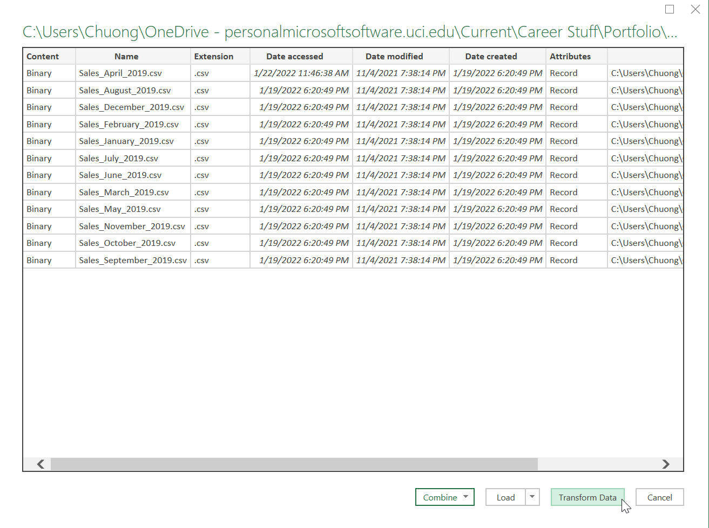

Before combining the files, PQ will show me a sample of the first file to make sure that the headers are separated correctly. 

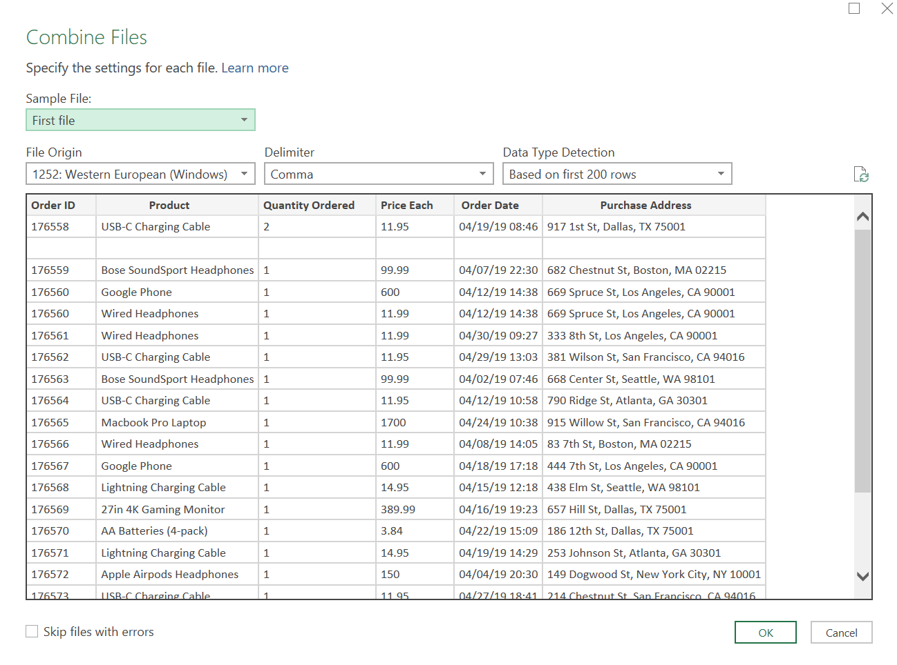

From this sample, I can tell that there are several issues to consider: 

- There will be multiple duplicate Order IDs since each order may contain multiple products
  
  - This can result in an incorrect order count during Pivot Table calculations

- The second row appears blank so there might be multiple blank rows throughout the dataset
  
  - PQ can eliminate blank rows easily

Once combined, I will work on transforming the sample file query. Beginning with cleaning up the headers and clearing blank rows, I apply the following steps: 

1. De-promote the headers since the header row will appear multiple times throughout the dataset

2. Manually retitle the column headers to prevent errors when adding new files to the dataset

3. Remove blank rows

4. Filter out the repeating column headers by filtering out the text “Order ID” from the Order ID column

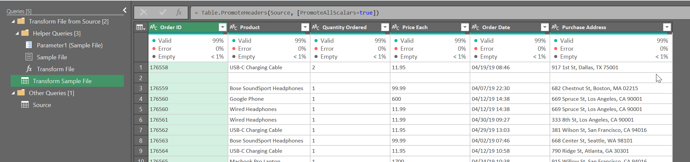

*Before*

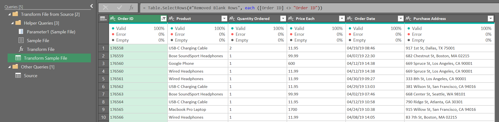

*After*

Next, I want to add a product category column and split the address column into Street, City, State, and Zip Code: 

1. Looking at the Product column, the last word(s) of each product can serve as a category (Google **Phone**, Wired **Headphones**, etc.) so I add a column and extract the last word from the Product Column

2. Then I will need to replace some values (iPhone -> Phone, (4-pack) -> Batteries, Machine & Dryer -> Laundry Appliance)

3. To extract the street address, I have PQ extract all the words before the first comma

4. To extract the city, I have PQ extract all the words between two commas

5. To extract the state abbreviation, I have PQ extract all the words between two spaces starting from the second occurrence at the end of the text string

6. To extract the ZIP Code, I have PQ extract the last word

7. Finally, I will have PQ detect the data type in each column

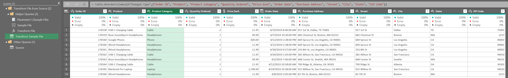

*After*

Finally, I will move from the sample fie query to the source query to finalize the columns and filter out any errors: 
1.	The “Source.Name” column at the beginning is not needed so that column will be deleted
2.	All the data should only be orders from 2019, so to double-check I will add a column to extract the year from the Order Date
3.	34 orders from 2020 snuck in so I will filter those orders out before performing calculations since they will only be outliers at the moment
4.	Finally, I will close and load the query into Excel

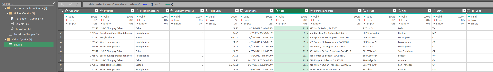

*After*

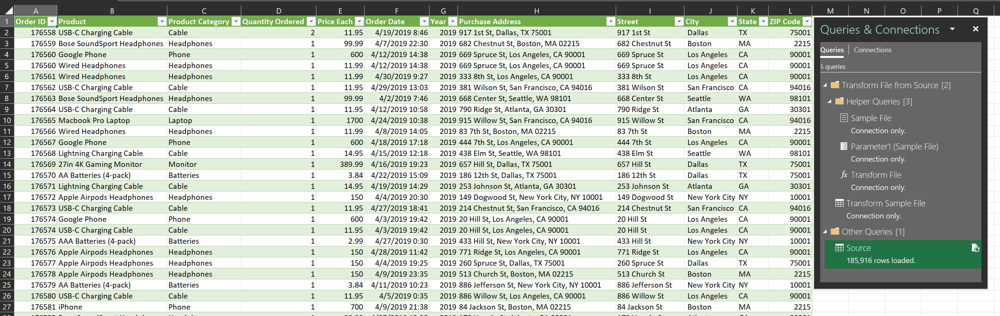

*185,916 rows later*

## Excel PivotTables

Using the Excel formula 

`=COUNTA(UNIQUE(column))` 

will allow me to count the number of unique orders which is 178,406, the true number of Order IDs in 2019. Therefore, I will need to add the table to my data model before creating the first pivot table: 

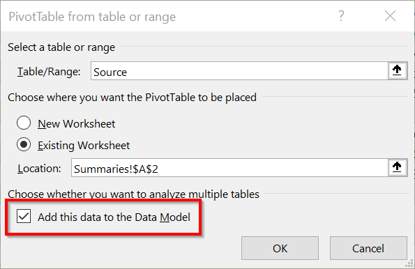

Adding the data to the data model allows Excel to count distinct or unique values. In this case, I want a pivot table of orders by month:

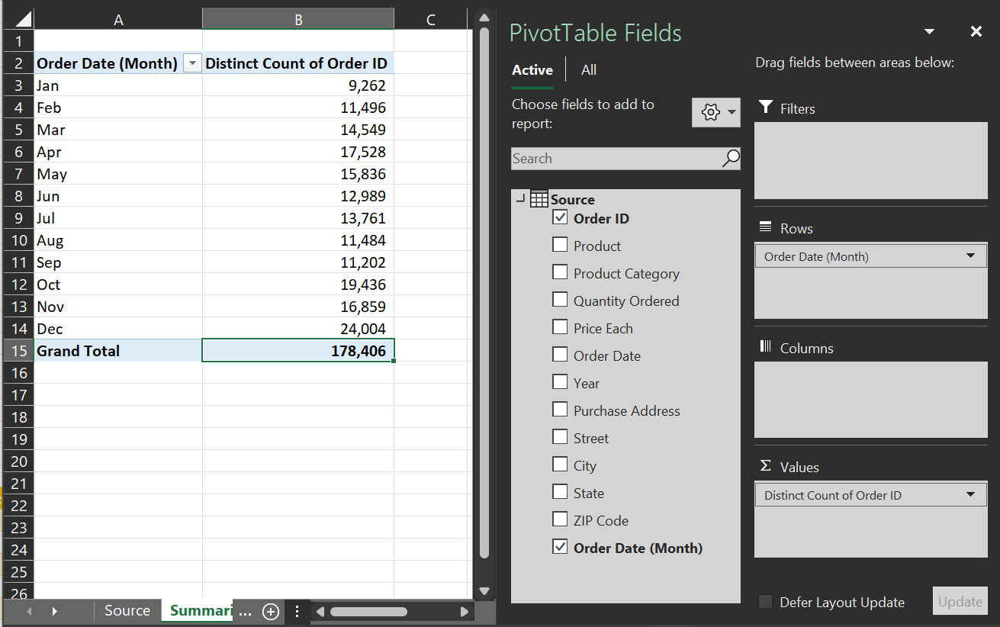

*Distinct Count of Order IDs*

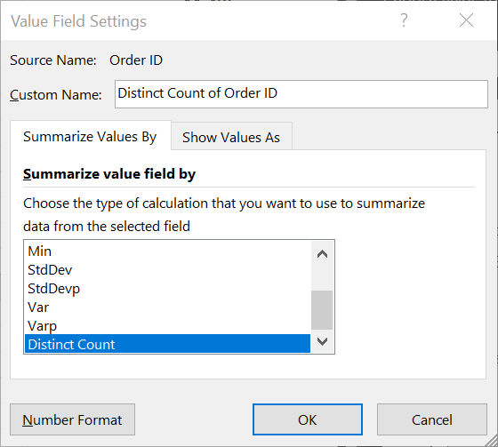

*Value Field Settings for Order ID*

Here is what the potential error would be if the user simply used the typical COUNT function:

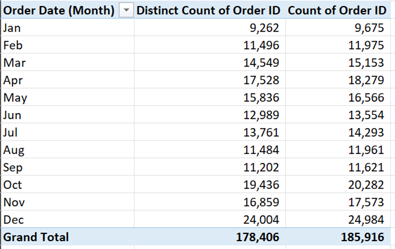

*Counting Orders vs Counting Rows*

Next, we want the total sales or revenue each month, but we will want to modify the table first since only the price of each product is listed, not the order total. To derive this order total, we can multiply the quantity ordered and the product price:

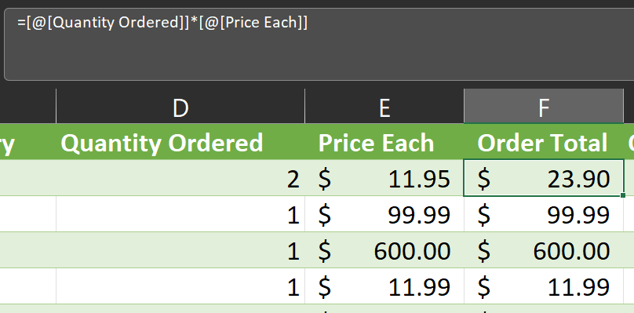

*Individual Price vs Order Total*

 

Once the Pivot Table is refreshed, I can add in the Order Total for each month:

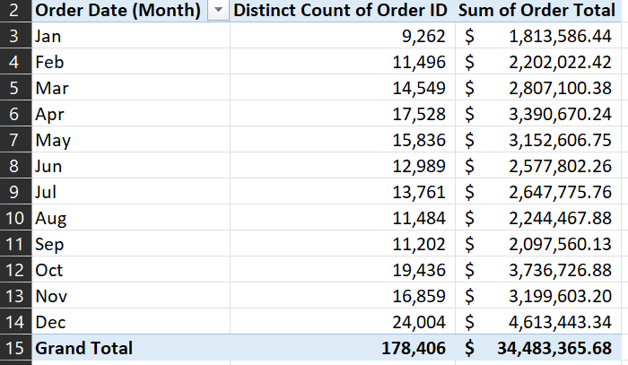

Once again, here is the potential error (the grand total of the year would have been short by almost $200K): 

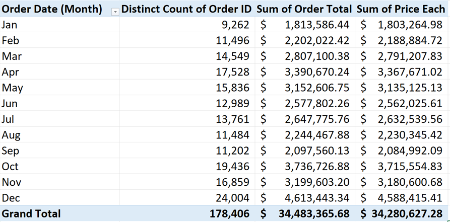

With these potential errors in mind, I will add more Pivot tables as requested, starting with Total Sales by Category:

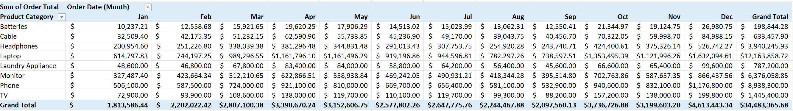

To get percentage of sales by category in each month, I will duplicate the previous table and adjust the value field settings:

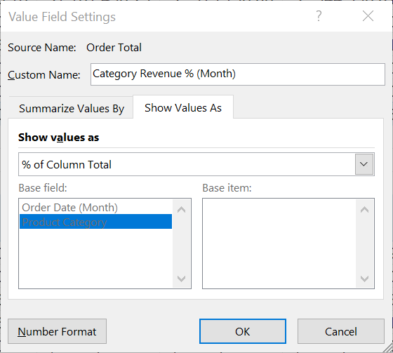

*Deriving Category Revenue % by Month*

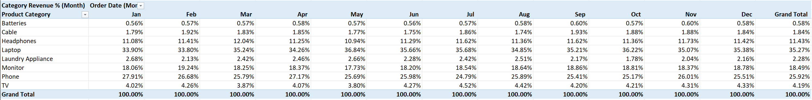

Next, I will repeat the process for the number of orders:

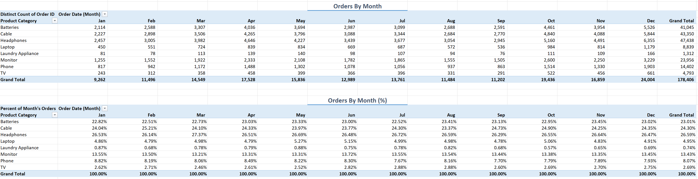

Since this summary turned out quite detailed, I will add a two-way VLOOKUP to quickly locate the key stats from the last four Pivot tables:

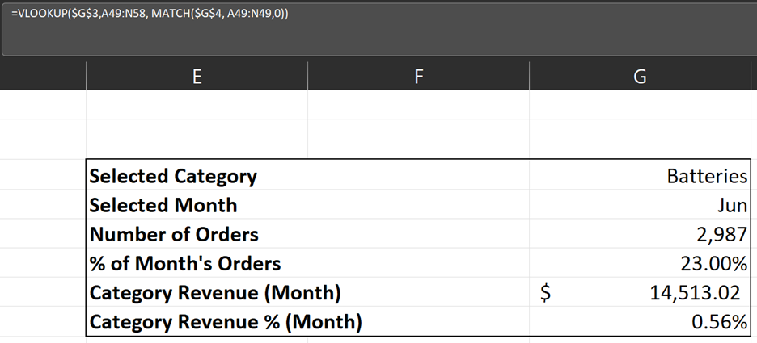

With some final formatting, this Excel report is done and ready to be delivered:

## Power BI

Since I already worked on the data a fair in Power Query, I can use Power BI’s (PBI) ability to import data from Excel to retrieve my query again. Once loaded, I double-checked the columns and readjusted data types as necessary:

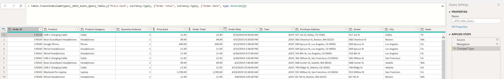

*Note: The query was renamed from “Source” to “2019_Sales_Query” for clarity*

In the past, I have encountered issues with dates formatted with times so in this case, I have changed the Order Date column to just a Date column instead of Date/Time.

Reference: https://community.powerbi.com/t5/Desktop/Date-table-returns-blank-months/m-p/906170

Because my data contains dates, I will create a calendar/date table in Power BI for good practice and to allow for better filtering and slicing of the data:

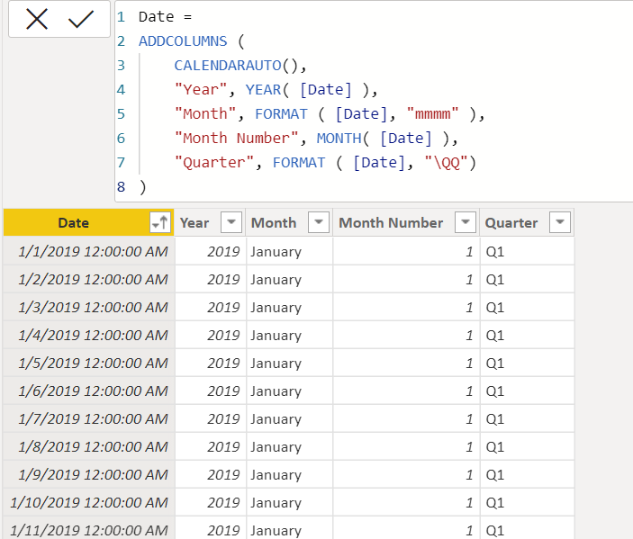

*Using some Data Analytics Expressions to create a quick date table*

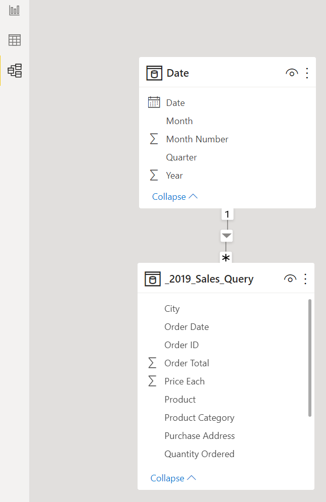

*Creating a relationship in the modeling tab*

Next, I will need to create some measures to help PBI show calculated totals and help with filtering:

`Total Orders = DISTINCTCOUNT(_2019_Sales_Query[Order ID])`

* Using the DISTINCTCOUNT function will prevent PBI from counting duplicate order IDs

`Total Sales = SUMX(_2019_Sales_Query, _2019_Sales_Query[Quantity Ordered]*_2019_Sales_Query[Price Each])`

* Since each row in our Sales query lists the product price and quantity ordered, PBI can calculate total sales by multiplying both of those values in each row then adding those calculated values. 

To double-check that the measures are working as intended, I created two matrix visuals to summarize the values above by month to match up with the previous PivotTables: 

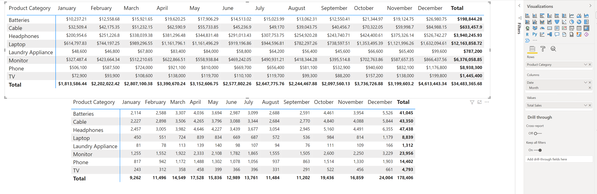

*The fields and measures used for the top matrix (Category Sales by Month) are present in the Visualizations panel*

To make sure that PBI can recognize the cities and states of each order, I will ensure that the Data Category of each column is set correctly:

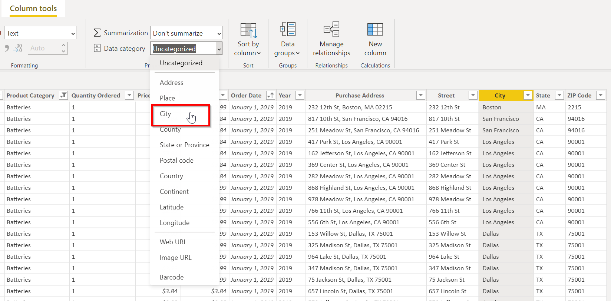

*Data Tab of PBI*

Finally, with all of the measures and columns set, I can begin building the visual portion of the dashboard. To begin, I want to add two cards, one showing total sales and one showing total orders for the whole year, followed by a monthly sales trend:

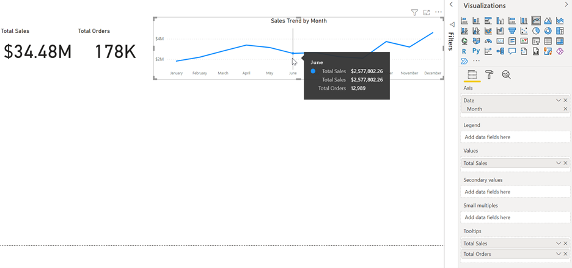

*Fields shown in the Visualizations Panel are for the line graph*

Next, I will add a stacked bar chart to quickly show sales by category and a matrix to show product level detail:

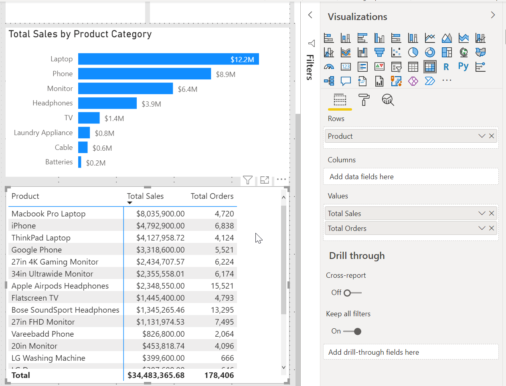

*Fields shown in the Visualizations Panel are for the matrix*

Then, to represent product sales by US state, I used the maps visual with Total Sales and Total Orders added to the tooltips:

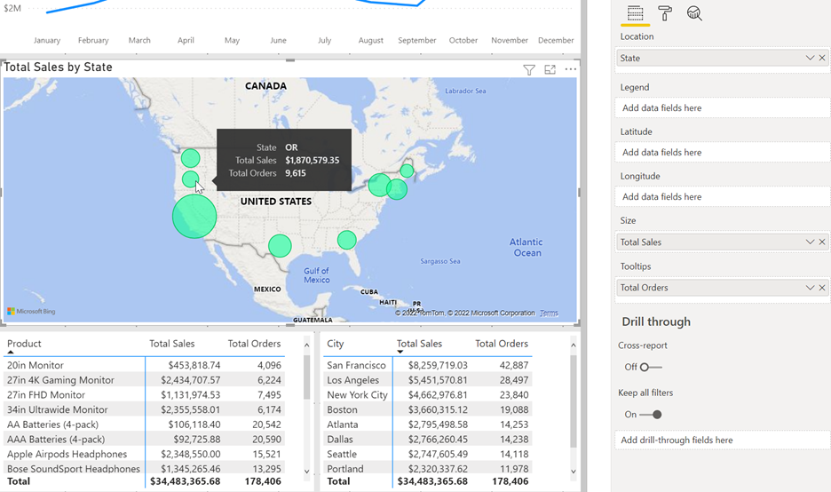

*Fields shown in the Visualizations Panel are for the map, a matrix for sales by city was added underneath the map.*

With some additional space left, I wanted to add a way to compare category sales by quarter. As a result, a stacked column chart with category sales by quarter would be sufficient: 

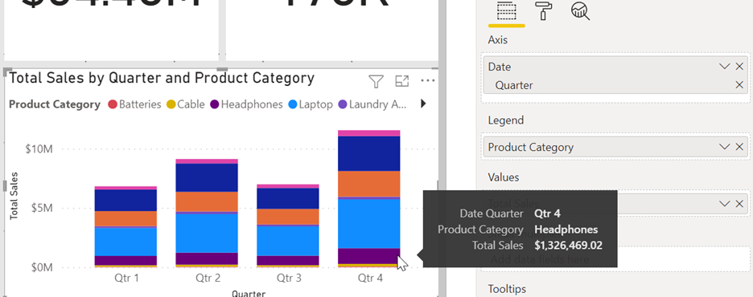

Finally, I will add a date slicer to the top of the dashboard to filter all the visuals on this page between a set of dates:

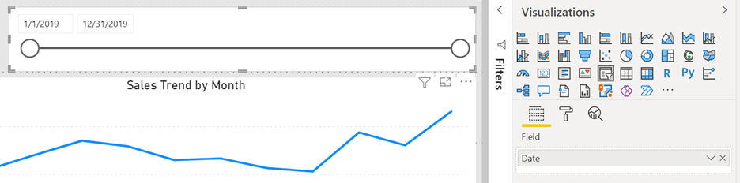

With all the visuals set, a bit of formatting will add consistency throughout the completed dashboard:

[Open interactive dashboard](https://app.powerbi.com/view?r=eyJrIjoiNTM2YzdiMDktODFjMC00MmFlLTk3OTAtYTM0YjgxZjBmMTE2IiwidCI6IjhjYTllYWNhLTZjNzctNGM5MC1hZTM1LTQ4NjhlMzFiNzRlZSIsImMiOjZ9)

# Conclusion

I completed this project to mimic the potential workflow of a business analyst. From using Excel as an ad-hoc analysis tool and Power Query, I was able to migrate that work into Power BI. This allowed for further segmenting and filtering of the data through clicking certain elements on the dashboard.

The amount of data being processed by businesses grows daily. As a result, my goal as a future business analyst is to learn the tools needed to process such datasets and along the way, discover meaningful insights to drive future business strategies.

